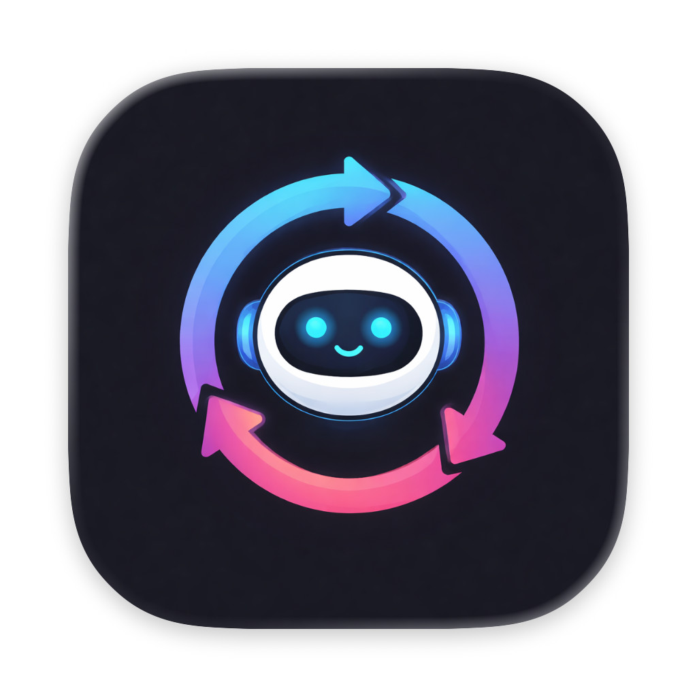
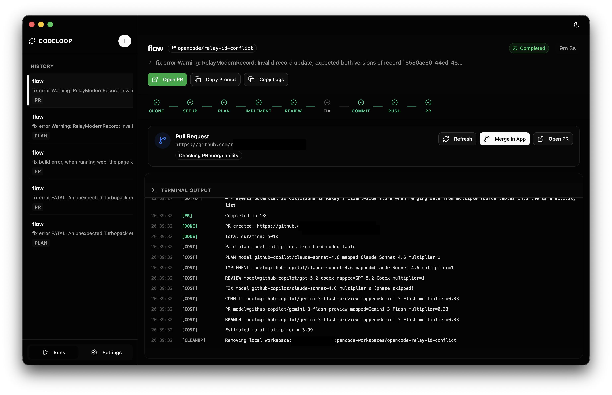

#  CodeLoop

CodeLoop is a sophisticated Electron-based desktop application that provides a modern, intuitive user interface for managing AI-powered code generation pipelines. It automates the entire software development lifecycle—from cloning a repository and creating an implementation plan to writing, reviewing, and fixing code, and finally submitting a pull request.



At its core, CodeLoop orchestrates the `opencode-loop.sh` script to run multi-step pipelines using various large language models.

## 🚀 Key Features

- **Full Pipeline Management**: Automates Clone, Setup, Plan, Implement, Review, Fix, Commit, Push, and PR phases.
- **Multi-Model Support**: Support for leading models including Claude 4.5/4.6, GPT-5/4o, Gemini 3.0/3.1, and more.
- **Real-time Monitoring**: Track pipeline progress phase-by-phase with a built-in log viewer and status indicators.
- **Configurable Workspaces**: Easily manage your development root and custom post-clone setup commands.
- **Repository Picker**: Quick access to recent repositories and easy validation of local git repos.
- **Interactive Configuration**: Fine-tune specific models for each phase of the pipeline (e.g., use Claude for planning and GPT for reviewing).

## 🛠️ Prerequisites

Before running CodeLoop, ensure you have the following installed:

1.  **Node.js & pnpm**: Required for the Electron desktop app.
2.  **GitHub CLI (`gh`)**: Follow the [GitHub CLI installation guide](https://cli.github.com/). Ensure you are authenticated via `gh auth login`.
3.  **OpenCode CLI**: The underlying tool for model interactions. Visit [opencode.ai](https://opencode.ai) for installation details.

## 🏁 Getting Started

### Development

1.  **Clone this repository**:
    ```bash
    git clone https://github.com/natelindev/code-loop.git
    cd code-loop
    ```

2.  **Install dependencies**:
    ```bash
    pnpm install
    ```

3.  **Start the development server**:
    ```bash
    pnpm dev
    ```

### Configuration

On the first launch, CodeLoop will create a default configuration in `~/.code-loop.json`. You can manage these settings directly within the app's **Settings** panel:
- **Workspace Root**: The directory where repositories will be cloned and managed.
- **Model Selection**: Choose different models for planning, implementing, reviewing, etc.
- **Post-Clone Commands**: Custom scripts (like `pnpm i`) to run after cloning a repo.

## 🏗️ Architecture

- **Frontend**: React + Vite + Tailwind CSS + Shadcn UI
- **Backend**: Electron (Node.js)
- **Core Logic**: Bash (`opencode-loop.sh`)
- **IPC**: Secure communication between renderer and main process for script execution and file system access.

## 📄 License

This project is licensed under the MIT License - see the [LICENSE](LICENSE) file for details.
